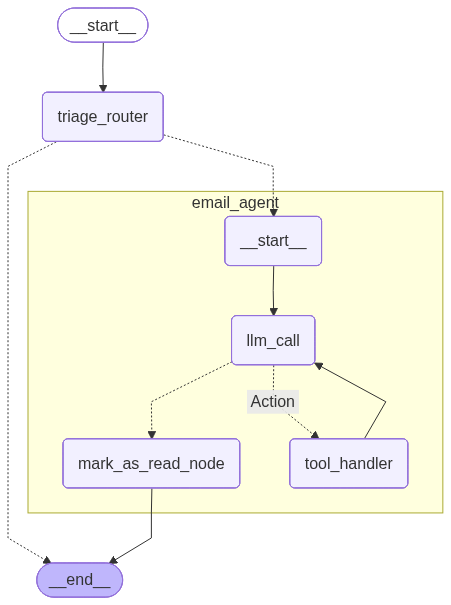

# PulseGraph - LangGraph Email Assistant

<p align="center">
  
</p>

An Executive assistant for mastering email and calendar overload.
Built with LangGraph to combine automation, memory, and human judgment, helping busy executives stay focused on what matters most.

This project is built from [Building Ambient Agents](https://github.com/langchain-ai/agents-from-scratch.git)

## Overview

The system can perform:

📨 Email triage: Intelligently routes and prioritizes incoming messages so you focus on what matters.

✍️ Contextual drafting: Creates polished, relevant responses tailored to the sender and situation.

📅 Action execution: Handles scheduling, meeting coordination, and inbox management seamlessly.

🧑‍💼 Human-in-the-loop: Lets you pause, approve, or adjust responses through intuitive workflows.

🧠 Persistent memory: Learns from past decisions to anticipate preferences and improve over time.

🔗 Gmail integration: Works directly with your real inbox for end-to-end productivity.

## Features

### Core Capabilities
- **Email Triage**: Automatically categorize and prioritize incoming emails
- **Response Generation**: Draft contextually appropriate email responses
- **Tool Integration**: Execute actions like calendar scheduling, email management
- **Human-in-the-Loop**: Allow human review and approval of agent actions
- **Memory System**: Persistent learning from past interactions and feedback
- **Gmail Integration**: Real Gmail API integration for production use

### LangGraph Patterns Demonstrated
- **Prompt Chaining**: Sequential LLM calls with quality gates
- **Parallelization**: Simultaneous processing for efficiency
- **Routing**: Intelligent input classification and routing
- **Orchestrator-Worker**: Dynamic task decomposition and delegation
- **Evaluator-Optimizer**: Iterative improvement with feedback loops
- **Agent Architecture**: Tool-calling agents with environmental feedback

## Quick Start

### Prerequisites
- Python 3.11+
- OpenAI API key
- (Optional) Gmail API credentials for Gmail integration

### Installation

**Recommended: Using uv (faster and more reliable)**

```bash
# Install uv if you haven't already
pip install uv

# Install the package with development dependencies
uv sync --extra dev
```

**Alternative: Using pip**

```bash
# Create and activate a virtual environment
python3 -m venv .venv
source .venv/bin/activate

# Ensure you have a recent version of pip
python3 -m pip install --upgrade pip

# Install the package in editable mode
pip install -e .
```

### Configuration

1. **Copy the environment template:**
   ```bash
   cp env.example .env
   ```

2. **Configure your environment variables:**
   ```bash
   # Required
   OPENAI_API_KEY=your_openai_api_key
   LANGSMITH_API_KEY=your_langsmith_api_key

   # Optional - for Gmail integration
   USE_GMAIL=True
   ```

3. **For Gmail integration, set up credentials:**
   ```bash
   # Follow the Gmail setup guide
   python src/email_assistant/tools/gmail/setup_gmail.py
   ```

## Usage

### Scenario 1:  Human Approval Workflow

[scenario1](src/run_hitl_scenario1.py)

### Scenario 2: Workflow with tool arguments editing

[scenario2](src/run_hitl_scenario2.py)

### Scenario 3: Human Workflow with Human feedback

[scenario3](src/run_hitl_scenario3.py)

### Scenario 4: Human Workflow with Human feedback

[scenario4](src/run_hitl_scenario4.py)

## Architecture

### Core Components

- **Workflows**: Main orchestration logic (`src/email_assistant/email_assistant_*.py`)
- **Nodes**: Individual processing units (`src/email_assistant/nodes/`)
- **Tools**: Action execution capabilities (`src/email_assistant/tools/`)
- **Chains**: LLM processing chains (`src/email_assistant/chains/`)
- **Persistence**: Memory and state management (`src/email_assistant/persistence/`)

### Workflow Diagrams

The system includes several workflow implementations with increasing complexity:

- **Basic Agent Workflow**: Shows the core email processing workflow
- **Human-in-the-Loop Workflow** (`src/images/agent_hitl_workflow.png`): Includes human approval points and interrupt handling
- **Memory-Enabled Workflow**: Extends HITL with persistent learning capabilities
- **Gmail Integration Workflow**: Full production integration with Gmail API

This diagram illustrates the LangGraph decision points and workflow :



### Tool System

The assistant supports two tool sets:

1. **Default Tools** (`src/email_assistant/tools/default/`):
   - Email composition and sending
   - Calendar management
   - Basic email operations

2. **Gmail Tools** (`src/email_assistant/tools/gmail/`):
   - Real Gmail API integration
   - Advanced email operations
   - Gmail-specific features

### Memory System

- **Short-term Memory**: Conversation context within a session
- **Long-term Memory**: Persistent learning across sessions
- **Feedback Integration**: Learning from human corrections and approvals

## Configuration Options

### Environment Variables

| Variable | Description | Default | Required |
|----------|-------------|---------|----------|
| `OPENAI_API_KEY` | OpenAI API key for LLM | - | Yes |
| `LANGSMITH_API_KEY` | LangSmith API key for tracing | - | Yes |
| `USE_GMAIL` | Enable Gmail integration | `False` | No |
| `POSTGRES_HOST` | Database host for persistence | `localhost` | No |
| `POSTGRES_PORT` | Database port | `5432` | No |
| `POSTGRES_DB` | Database name | `email_assistant` | No |
| `POSTGRES_USER` | Database user | `postgres` | No |
| `POSTGRES_PASSWORD` | Database password | - | No |

### Gmail Configuration

For Gmail integration, you need to:

1. Set up Gmail API credentials
2. Configure OAuth2 authentication
3. Set `USE_GMAIL=True` in your environment

See `src/email_assistant/tools/gmail/README.md` for detailed setup instructions.

## Development

### Project Structure

```
src/email_assistant/
├── chains/              # LLM processing chains
├── nodes/               # Workflow nodes
├── tools/               # Tool implementations
│   ├── default/         # Default email tools
│   └── gmail/           # Gmail API tools
├── persistence/         # Memory and state management
├── eval/                # Evaluation framework
└── *.py                 # Main workflow files
```
